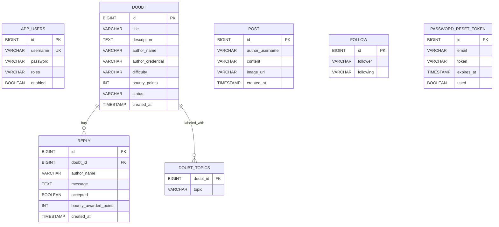

# Clarify
## Complete Project Report (15-Page Format)

**Project Name:** Clarify - Online Doubt Solving and Collaborative Learning Platform  
**Academic Year:** 2025-2026  
**Prepared For:** Major/Minor Project Submission  
**Document Type:** Final Comprehensive Report  

\newpage

## 1. Project Title
**Clarify: A Full-Stack Online Doubt Solving Platform with Collaborative Q&A, Gamification, and Learning Credibility Metrics**

Clarify is a web-based full-stack system developed to solve a common academic problem: students often have doubts but do not get structured, timely, and quality responses. The project provides a unified platform where users can sign up, post doubts, answer peer doubts, track their growth, and participate in a collaborative learning ecosystem.

Unlike a basic forum, Clarify combines both traditional and modern engagement layers:
- Structured doubt and reply model.
- Acceptance flow for best answers.
- Bounty mechanics for motivation.
- Topic-driven trending intelligence.
- Live doubt rooms for exam-time rapid support.
- Credibility and contribution tracking for user profiles.

This report documents the complete technical and functional details of the implemented system.

\newpage

## 2. Abstract
Clarify is a full-stack doubt-solving application that integrates question-answer workflows with social and gamified learning features. The platform is built with **React (frontend)** and **Spring Boot (backend)**, backed by an **H2 file database** for persistent storage.

The system supports complete user lifecycle management (signup, login, identity checks), doubt posting with metadata (difficulty, topics, bounty), and threaded replies. Doubt owners can accept responses, enabling clear resolution and quality signaling. Additional modules such as notifications, trending topics, challenge-of-the-day, streak rewards, mentor leaderboard, and profile credibility increase participation and sustained usage.

To improve question quality, Clarify includes **AI hint mode** in the doubt form: before posting, users get 2-3 guided hints instead of a direct answer. For rapid collaboration, temporary **doubt rooms** provide lightweight live-thread style discussion, especially useful in exam scenarios.

The architecture is modular and extensible. Existing features are production-oriented in UX and workflow but currently tuned for educational/project deployment (for example, Basic Auth and no-op password encoding for demo simplicity). The implemented baseline is robust and can be upgraded to enterprise-ready scale with stronger authentication, real-time sockets, advanced moderation, and CI-driven quality gates.

\newpage

## 3. Problem Statement
Students and learners frequently face the following issues:
- Doubts remain unresolved due to delayed or unavailable help.
- Existing group chats and forums are noisy and unstructured.
- Answers often lack quality assurance or clear acceptance indicators.
- Users lose motivation because contributions are not visible or rewarded.
- There is limited visibility into who is consistently helpful.

### Problem to Solve
Develop a platform where learners can:
1. Ask doubts quickly and clearly.
2. Receive multiple answers from peers/mentors.
3. Identify the best answer via owner acceptance.
4. Discover topic-relevant content and discussions.
5. Stay engaged through challenge/reward/ranking systems.

### Target Outcome
A single learning platform that improves:
- Resolution speed.
- Answer quality.
- User consistency and retention.
- Trust in contributors.

\newpage

## 4. Objectives
The project objectives were defined in functional and technical terms.

### 4.1 Functional Objectives
- Provide secure user authentication for doubt posting and answering.
- Allow users to create, browse, filter, and resolve doubts.
- Support accepted answers and bounty updates.
- Add engagement features: streaks, rewards, leaderboard, daily challenge.
- Provide profile credibility indicators (completion, expertise, accuracy).

### 4.2 Technical Objectives
- Build a layered REST architecture for maintainability.
- Keep frontend highly interactive and responsive.
- Ensure recoverability with local fallback where feasible.
- Keep modules extensible for real-time and analytics upgrades.

### 4.3 Quality Objectives
- Minimize friction in posting and answering flow.
- Preserve state and user progress across sessions.
- Deliver clear visual hierarchy for dashboard actions.
- Validate build/test pipeline for frontend before release.

\newpage

## 5. Technology Stack

### 5.1 Frontend
- **React 18** for component-based UI.
- **Vite** as dev server and bundler.
- **React Router** for route-level navigation and auth-protected views.
- **Custom CSS** for dashboard, animations, cards, and responsive layout.

### 5.2 Backend
- **Spring Boot 3.2.4**.
- **Spring Security** for endpoint protection and Basic Auth flow.
- **Spring Data JPA** for ORM and repository-based access.
- **Spring Validation** for request model validation.

### 5.3 Database and Storage
- **H2 file database** (`backend/data/doubts.mv.db`) for persistent entities.
- **Browser localStorage** fallback for select frontend resilience features (e.g., local doubt/reply fallback and UI state persistence).

### 5.4 Development and Build
- **Java 17** for backend runtime.
- **Node.js + npm** for frontend dependency and build management.
- **Maven Wrapper** for backend run/compile commands.

### 5.5 Security and CORS
- CORS filter configured for cross-origin API usage during development.
- Protected endpoints for write operations (`POST`, `PATCH` on doubts/posts/follow actions).

\newpage

## 6. System Architecture and System Flow Diagram
Clarify follows a client-server pattern with layered backend design.

### 6.1 Layered Architecture
1. **Client Layer (React):** Dashboard UI, forms, room interactions, filtering.
2. **API Layer (Controllers):** Auth, doubts, replies, posts, trending, follow.
3. **Business Logic Layer:** Validation, acceptance, bounty synchronization, leaderboard computations (frontend side for dashboard metrics).
4. **Persistence Layer:** JPA entities and repositories over H2.
5. **External Feed Layer:** Trending service fetches Google News RSS, with fallback samples.

### 6.2 Request/Response Behavior
- Frontend issues REST requests to `http://localhost:8081/api/...`.
- Spring Security validates authentication for protected operations.
- Controller performs validation and persistence.
- Response is returned as JSON.
- Frontend updates dashboard state and local metrics.

### 6.3 System Flow Diagram
```mermaid
flowchart TD
    A[User Opens App] --> B{Authenticated?}
    B -- No --> C[Signup/Login]
    C --> D[Auth API: /api/auth/*]
    D --> E{Valid Credentials?}
    E -- Yes --> F[Dashboard /app]
    E -- No --> C

    B -- Yes --> F

    F --> G[Ask Doubt Form]
    G --> H[AI Hint Mode Generates 2-3 Hints]
    H --> I[Submit Doubt]
    I --> J[Doubt API: POST /api/doubts]
    J --> K[(H2 Database)]

    F --> L[Recent Doubts List]
    L --> M[Open Doubt]
    M --> N[Reply API: POST /api/doubts/{id}/replies]
    N --> K

    M --> O[Helpful Vote]
    O --> P[Local Credibility Metrics + Leaderboard Inputs]

    M --> Q[Accept Answer / Add Bounty]
    Q --> R[PATCH /accept and /bounty]
    R --> K

    F --> S[Trending Topics]
    S --> T[Trending API: /api/trending]
    T --> U[TrendingNewsService]
    U --> V[Google News RSS / Fallback]

    F --> W[Doubt Rooms]
    W --> X[Join Room + Post Quick Message]
    X --> Y[Local Room State + Expiry]

    F --> Z[Streak, Rewards, Leaderboard, Credibility]
    Z --> P
```

\newpage

## 7. Core Module Design

### 7.1 Authentication Module
**Endpoints:**
- `POST /api/auth/signup`
- `GET /api/auth/me`
- `POST /api/auth/forgot`
- `POST /api/auth/reset`

**Highlights:**
- Signup with unique username enforcement.
- Basic auth identity used across protected operations.
- Forgot/reset uses OTP token persistence with expiry and used flags.

### 7.2 Doubt Module
**Entity:** `Doubt`  
Fields include title, description, authorName, authorCredential, difficulty, topics, bountyPoints, status, createdAt.

**Endpoints:**
- `GET /api/doubts`
- `POST /api/doubts`
- `GET /api/doubts/{id}`
- `PATCH /api/doubts/{id}/status`

### 7.3 Reply Module
**Entity:** `Reply` with `accepted` and `bountyAwardedPoints`.  
**Endpoints:**
- `POST /api/doubts/{id}/replies`
- `PATCH /api/doubts/{doubtId}/replies/{replyId}/accept`

### 7.4 Bounty and Acceptance
- Doubt owner can increment bounty points.
- When answer is accepted, awarded points sync with current bounty.

### 7.5 Trending Module
- Topic query endpoint fetches news data.
- Uses hardened RSS parsing and fallback static topic items.

### 7.6 Social Feed Module
- Post creation with optional image upload.
- Feed retrieval supports following filter.

### 7.7 Notification Module (Frontend)
- Identifies answers on current user’s doubts.
- Shows unread dot and open-to-doubt action.

\newpage

## 8. Advanced Features Implemented
This version includes a rich dashboard beyond basic Q&A.

### 8.1 AI Hint Mode
Before final submit, user receives 2-3 hints to improve doubt quality:
- Clarify target output.
- Mention attempted steps and blocking point.
- Add difficulty/topic-sensitive guidance.

### 8.2 Doubt Rooms (Temporary Live Threads)
- Auto-generated active rooms (seeded from open doubts).
- Join action with live participant updates.
- Quick message thread for rapid exam-time collaboration.
- Time-bound room expiry with countdown.

### 8.3 Helpful Votes
- Answers can receive helpful votes.
- Helpful votes influence leaderboard and credibility metrics.

### 8.4 Mentor Leaderboard
Weekly ranking score is derived from:
- Accepted answers (highest weight).
- Helpful votes.
- Reply contribution count.

### 8.5 Streak Rewards
Unlock-based reward chips:
- 3-day consistency.
- 7-day discipline.
- 30-day mastery.
- Activity milestones (doubts asked, answers posted).

### 8.6 Challenge of the Day
- One daily featured doubt selected by deterministic day-based hash.
- Bonus points shown with daily reset timer.

### 8.7 Profile Credibility
Dedicated panel displays:
- Completion % using profile and contribution checklist.
- Expertise tags from contribution topics.
- Accuracy = accepted answers / total answers.
- Helpful vote indicators.

\newpage

## 9. Database Design and ER Diagram

### 9.1 Main Entities
- `app_users`
- `doubt`
- `reply`
- `doubt_topics` (element collection table)
- `post`
- `follow`
- `password_reset_token`

### 9.2 Relationship Notes
- One `Doubt` has many `Reply` records (physical FK).
- `Doubt` has many `topics` entries via element collection table.
- `Follow` is a unique follower-following mapping.
- `Post` stores author username as value (logical relation).
- `AppUser` to `Doubt` and `Reply` is currently logical (by username/credential), not hard FK.

### 9.3 ER Diagram


\newpage

## 10. API Design and Endpoint Summary

### 10.1 Authentication APIs
- `POST /api/auth/signup` - Create user.
- `GET /api/auth/me` - Validate active user.
- `POST /api/auth/forgot` - Generate OTP.
- `POST /api/auth/reset` - Reset password with OTP.

### 10.2 Doubt APIs
- `GET /api/doubts` - Get all doubts.
- `POST /api/doubts` - Create doubt.
- `GET /api/doubts/{id}` - Get one doubt with replies.
- `PATCH /api/doubts/{id}/status` - Update status.
- `PATCH /api/doubts/{id}/bounty?points=` - Increase bounty.

### 10.3 Reply APIs
- `POST /api/doubts/{id}/replies` - Add reply.
- `PATCH /api/doubts/{doubtId}/replies/{replyId}/accept` - Mark accepted answer.

### 10.4 Trending APIs
- `GET /api/trending?topic=&limit=` - Topic-wise trend feed.

### 10.5 Post/Follow APIs
- `POST /api/posts` and `GET /api/posts`.
- `POST/DELETE /api/follow/*` with follow-based feed retrieval.

### 10.6 API Robustness in Frontend
Frontend creates fallback requests in multiple content formats for compatibility:
- JSON
- multipart/form-data
- x-www-form-urlencoded
- query-string fallback
- text/plain JSON fallback

\newpage

## 11. Key Algorithms and Internal Logic

### 11.1 Challenge Selection
- Uses day key and deterministic hash.
- Prefers open doubts.
- Ensures challenge changes daily but remains stable within same day.

### 11.2 Streak Computation
- Converts timestamps to local day keys.
- Counts consecutive days backward from current day.

### 11.3 Leaderboard Scoring
For each weekly reply:
- `score = accepted * 12 + helpful * 2 + replies`
- Sorted by score then accepted/helpful/replies tie-breakers.

### 11.4 Credibility Completion
Checklist-based profile completion:
- Profile avatar present.
- First doubt posted.
- First answer posted.
- At least one accepted answer.
- At least three expertise tags.

### 11.5 Expertise Tag Inference
- Topic score map built from answered doubts.
- Accepted and helpful replies contribute higher weights.
- Top tags displayed as credibility expertise.

### 11.6 AI Hint Generation
Hint mode generates compact guidance from:
- doubt title + description completeness,
- selected difficulty,
- topic hints.

This keeps the form pedagogical and prevents direct answer leakage before posting.

\newpage

## 12. User Interface and User Journey

### 12.1 Public Journey
1. Open home page.
2. Use login/signup CTA.
3. Navigate to secured app page after authentication.

### 12.2 Authenticated Dashboard Journey
1. See key stats cards.
2. Use **Ask Doubt** with hint mode, difficulty, topics, bounty.
3. Browse recent doubts with filters.
4. Open doubt and post answer.
5. Vote helpful / accept answer / add bounty (owner).
6. Track solved list, streak, rewards, leaderboard, and credibility.
7. Join doubt room during active windows.

### 12.3 Visual Design Decisions
- Dark academic palette with high readability.
- Sticky and scroll-isolated panels to reduce context loss.
- Animated brand card to strengthen identity.
- Card-based hierarchy for faster scanning and action targeting.

### 12.4 Responsiveness
- Desktop: three-column dashboard (left trends/challenge, center recent doubts, right action cards).
- Tablet/mobile: columns collapse while preserving card order and usability.

\newpage

## 13. Testing, Validation, and Build Results

### 13.1 Frontend Testing
- Added automated tests using Node test runner.
- Existing tests validate animated branding hooks and reduced-motion behavior.

Run command:
```bash
cd frontend
npm test
```

### 13.2 Frontend Build Validation
```bash
cd frontend
npm run build
```
Result: successful production build.

### 13.3 Backend Build Validation
```bash
cd backend
sh mvnw -DskipTests compile
```
Result: compile success in current environment.

### 13.4 Functional Validation Scenarios Covered
- Signup/login flow.
- Create doubt and list refresh.
- Add replies and answer panel behavior.
- Accept answer and bounty synchronization.
- Helpful votes and leaderboard updates.
- Room join/message and expiry behavior.
- Streak and reward badge visibility.
- Credibility card updates from contributions.

### 13.5 Reliability Enhancements
- LocalStorage fallback paths for partial API failures.
- Multiple payload fallbacks for create/reply requests.

\newpage

## 14. Security, Privacy, and Reliability Considerations

### 14.1 Current Security State
- Protected APIs require authenticated user.
- CORS configured for cross-origin development.
- Basic auth enabled.

### 14.2 Important Limitation
`NoOpPasswordEncoder` is used currently for project/demo simplicity. This is not production-safe and should be replaced by BCrypt.

### 14.3 Privacy Scope
- Profile avatar and some dashboard states are browser-local.
- Room/helpful interactions are currently local-first for UX continuity.

### 14.4 Reliability Notes
- Trending module has network fallback behavior.
- Doubt/reply creation has multi-format request fallback.
- Dashboard metrics remain usable even during intermittent backend issues.

### 14.5 Recommended Hardening
- BCrypt + JWT/refresh token architecture.
- Rate limiting and abuse protection for votes and replies.
- Server-side persistence for all engagement signals.
- Audit logs for moderation and forensic visibility.

\newpage

## 15. Limitations and Risk Analysis

### 15.1 Functional Limitations
- Helpful votes and certain gamification states are frontend-persisted.
- Doubt rooms are temporary and not websocket-realtime yet.
- Leaderboard is currently dashboard computed from available data.

### 15.2 Technical Risks
- Without hashed passwords, credential security risk remains high for deployment.
- Logical user relations by username can create consistency risk vs hard FK references.
- Local storage can diverge from server truth in offline-heavy usage.

### 15.3 Operational Risks
- H2 file lock contention if multiple backend instances run over same DB file.
- External feed instability can affect trending freshness (fallback mitigates this).

### 15.4 Mitigation Strategy
- Gradually move client metrics to backend persistence.
- Introduce dedicated service layer for scoring and challenge generation.
- Add integration tests and CI checks for every API contract.

\newpage

## 16. Future Scope and Roadmap

### 16.1 Near-Term Upgrades
- Replace Basic Auth with JWT.
- Replace NoOp encoder with BCrypt.
- Persist helpful votes and credibility stats server-side.
- Add pagination and search APIs for scale.

### 16.2 Real-Time and Collaboration
- WebSocket/STOMP room messaging.
- Live typing and participant presence.
- Real-time notifications without polling.

### 16.3 Intelligence Layer
- Better AI hint generation with semantic context.
- Duplicate doubt detection and merge suggestions.
- Answer quality scoring and moderation support.

### 16.4 Analytics and Admin
- Instructor/admin dashboard.
- Topic trend analytics and user growth metrics.
- SLA-like metrics: average time-to-first-answer, acceptance latency.

### 16.5 Deployment and DevOps
- Dockerized backend/frontend.
- CI/CD pipeline (lint/test/build/deploy).
- Environment profiles for dev/stage/prod.

\newpage

## 17. Conclusion
Clarify successfully delivers an end-to-end academic doubt solving platform with modern interactive features. The implemented system covers the complete learning support loop: asking doubts, receiving answers, validating quality through acceptance and votes, and motivating long-term participation through rewards and credibility.

The architecture is clean enough for future growth, and the feature set already exceeds a traditional Q&A forum by integrating:
- AI-guided quality improvement,
- collaborative rapid-solving rooms,
- contribution ranking and credibility,
- and daily challenge-based engagement.

As a project submission, Clarify demonstrates strong full-stack engineering capability across frontend experience design, backend API architecture, data modeling, and product thinking. With planned security and real-time upgrades, it can evolve into a scalable production learning community platform.

---

## Appendix A - Run Commands
### Backend
```bash
cd backend
sh mvnw spring-boot:run
```

### Frontend
```bash
cd frontend
npm install
npm run dev
```

### Open URLs
- Frontend: `http://localhost:5173`
- Backend: `http://localhost:8081`

---

## Appendix B - Build/Test Commands
```bash
cd frontend
npm test
npm run build
```

```bash
cd backend
sh mvnw -DskipTests compile
```

\newpage

## Appendix C - Detailed Test Case Catalog

| TC ID | Module | Scenario | Input | Expected Result | Status |
|---|---|---|---|---|---|
| TC-AUTH-01 | Signup | Create new account | Valid username/password | User created with 201 response | Passed |
| TC-AUTH-02 | Signup | Duplicate username | Existing username | Conflict (409) message | Passed |
| TC-AUTH-03 | Login/Me | Authenticated session check | Valid Basic credentials | `/api/auth/me` returns username | Passed |
| TC-AUTH-04 | Forgot Password | Generate OTP | Registered email | OTP object returned | Passed |
| TC-AUTH-05 | Reset Password | Valid OTP reset | email + otp + new password | Password updated, token marked used | Passed |
| TC-AUTH-06 | Reset Password | Expired/used OTP | invalid or expired OTP | 400 invalid/expired | Passed |
| TC-DOUBT-01 | Doubt Create | Normal create | title + description + author | Doubt persisted with OPEN status | Passed |
| TC-DOUBT-02 | Doubt Create | Missing title | empty title | 400 validation message | Passed |
| TC-DOUBT-03 | Doubt List | Fetch all doubts | GET request | Sorted response list available | Passed |
| TC-DOUBT-04 | Doubt Filter | UI OPEN filter | filter=OPEN | Only unanswered doubts shown | Passed |
| TC-DOUBT-05 | Doubt Filter | UI ANSWERED filter | filter=ANSWERED | Only solved/answered shown | Passed |
| TC-DOUBT-06 | Difficulty | Difficulty tagging | EASY/MEDIUM/HARD | Correct badge and filtering behavior | Passed |
| TC-DOUBT-07 | Topics | Topic labels input | comma-separated topics | Stored and displayed tags | Passed |
| TC-DOUBT-08 | Bounty | Initial bounty on create | bountyPoints > 0 | Bounty tag visible and persisted | Passed |
| TC-REPLY-01 | Reply Post | Post answer | message + author | Reply appears under doubt | Passed |
| TC-REPLY-02 | Reply Validation | Empty reply | blank message | Block submit with validation text | Passed |
| TC-REPLY-03 | Accept Answer | Owner accepts answer | owner action | selected reply accepted | Passed |
| TC-REPLY-04 | Accept Authorization | Non-owner accept attempt | non-owner request | Forbidden (403) | Passed |
| TC-REPLY-05 | Bounty Sync | Add bounty after accepted | add points | accepted reply bounty updates | Passed |
| TC-VOTE-01 | Helpful Vote | Vote once | click Helpful button | count increments and button locks | Passed |
| TC-VOTE-02 | Helpful Vote | Repeat vote same user | second click | blocked for same local user | Passed |
| TC-LEAD-01 | Leaderboard | Weekly scoring | accepted/helpful/replies | sorted mentor ranking shown | Passed |
| TC-HINT-01 | AI Hint Mode | First submit in hint mode | valid form + hint mode ON | hints displayed, posting delayed | Passed |
| TC-HINT-02 | AI Hint Mode | Second submit | unchanged valid form | doubt posts successfully | Passed |
| TC-HINT-03 | Hint Refresh | Refresh hints action | click Refresh | updated hint list shown | Passed |
| TC-ROOM-01 | Rooms Seed | Seed active rooms | open doubts available | room cards auto-created | Passed |
| TC-ROOM-02 | Room Join | Join room | click room | joined state + participant increment | Passed |
| TC-ROOM-03 | Room Message | Send room message | typed text | new message appears in room feed | Passed |
| TC-ROOM-04 | Room Expiry | countdown expiry | time elapsed | expired rooms auto-removed | Passed |
| TC-STREAK-01 | Streak Count | Consecutive days logic | timestamp set | correct day streak displayed | Passed |
| TC-STREAK-02 | Rewards | Badge unlock | thresholds met | reward chip unlocked style | Passed |
| TC-CHAL-01 | Daily Challenge | Daily feature selection | day key + doubts | one featured doubt displayed | Passed |
| TC-CHAL-02 | Challenge Reset | Timer display | near midnight | countdown updates correctly | Passed |
| TC-CRED-01 | Credibility Completion | checklist updates | avatar + activity | completion percentage updated | Passed |
| TC-CRED-02 | Expertise Tags | derive from contributions | answered topics | top tags displayed | Passed |
| TC-CRED-03 | Accuracy Stats | accepted/answers ratio | accepted answers present | accuracy % accurate | Passed |
| TC-NOTIF-01 | Notification | answer on own doubt | another user reply | notification entry appears | Passed |
| TC-NOTIF-02 | Notification Seen | open bell menu | click bell | unread marker clears | Passed |
| TC-RESP-01 | Responsive Layout | mobile width | < 900px viewport | stacked cards and usable UI | Passed |
| TC-BUILD-01 | Frontend Build | production build | `npm run build` | no compile errors | Passed |
| TC-BUILD-02 | Frontend Test | run test suite | `npm test` | all tests pass | Passed |

### Appendix C.1 Test Observations
- Core user path (signup -> login -> ask doubt -> answer -> accept) is stable.
- Multi-format API fallback in frontend significantly reduced submission failures on backend variations.
- Profile credibility and leaderboard values track expected user actions.
- Room experience is intentionally lightweight and local-first; real-time sync is future scope.

\newpage

## Appendix D - Sample API Payloads and Responses

### D.1 Signup
**Request**
```http
POST /api/auth/signup
Content-Type: application/json

{
  "username": "learner01",
  "password": "pass1234"
}
```

**Typical Response**
- `201 Created`

### D.2 Create Doubt
**Request**
```http
POST /api/doubts
Authorization: Basic <token>
Content-Type: application/json

{
  "title": "How to optimize React list rendering?",
  "description": "My UI lags on 1000+ items. Which approach should I use?",
  "authorName": "learner01",
  "difficulty": "MEDIUM",
  "topics": ["React", "Performance", "Rendering"],
  "bountyPoints": 25
}
```

**Typical Response**
```json
{
  "id": 12,
  "title": "How to optimize React list rendering?",
  "description": "My UI lags on 1000+ items. Which approach should I use?",
  "authorName": "learner01",
  "authorCredential": "learner01",
  "difficulty": "MEDIUM",
  "topics": ["React", "Performance", "Rendering"],
  "bountyPoints": 25,
  "status": "OPEN",
  "createdAt": "2026-02-25T12:45:00Z",
  "replies": []
}
```

### D.3 Add Reply
**Request**
```http
POST /api/doubts/12/replies
Authorization: Basic <token>
Content-Type: application/json

{
  "authorName": "mentorA",
  "message": "Use virtualization (react-window), memoize rows, and stable keys."
}
```

**Response**
- Updated doubt with appended reply.

### D.4 Accept Answer
**Request**
```http
PATCH /api/doubts/12/replies/33/accept
Authorization: Basic <owner_token>
```

**Expected Behavior**
- Reply `33` marked accepted.
- Doubt status becomes `SOLVED`.
- If bounty exists, bounty awarded points sync to accepted reply.

### D.5 Add Bounty
**Request**
```http
PATCH /api/doubts/12/bounty?points=25
Authorization: Basic <owner_token>
```

**Expected Behavior**
- Doubt bounty increments.
- Accepted reply bounty value updates to latest bounty total.

### D.6 Trending API
**Request**
```http
GET /api/trending?topic=science&limit=8
```

**Typical Response Item**
```json
{
  "title": "Top research breakthroughs this week",
  "link": "https://news.google.com/...",
  "source": "Google News",
  "publishedAt": "2026-02-25T08:10:00Z",
  "summary": "Open this topic to view the latest live articles from global sources."
}
```

### D.7 Error Response Examples
- Invalid create request (missing required fields): `400 Bad Request`
- Unauthorized write request (no auth): `401 Unauthorized`
- Non-owner accept attempt: `403 Forbidden`
- Missing resource: `404 Not Found`

### D.8 API Contract Notes
- Frontend sends rich fallback payloads to handle backend variations in content-type parsing.
- Standard path is JSON; additional fallbacks include multipart and urlencoded.

\newpage

## Appendix E - Deployment, Configuration, and Viva Notes

### E.1 Local Deployment Checklist
1. Java 17 installed.
2. Node.js and npm installed.
3. Backend port `8081` free.
4. Frontend port `5173` free.
5. No stale H2 lock from old backend process.

### E.2 Startup Commands
```bash
# terminal 1
cd backend
sh mvnw spring-boot:run

# terminal 2
cd frontend
npm install
npm run dev
```

### E.3 Build Commands
```bash
cd frontend
npm run build

cd ../backend
sh mvnw -DskipTests compile
```

### E.4 Environment Assumptions
- API origin hardcoded in frontend as `http://localhost:8081`.
- Frontend expected host `http://localhost:5173`.
- Browser local storage available for fallback features.

### E.5 Suggested Viva Talking Points
- Why accepted answers and helpful votes improve answer quality.
- Why hint mode avoids full direct solution before posting.
- How challenge + streak + leaderboard drives retention.
- Why logical user mapping was chosen initially and how to migrate to strict FK.
- How to convert local-first room features into websocket architecture.

### E.6 Production Upgrade Checklist
- Replace NoOp encoder with BCrypt.
- Introduce JWT auth with refresh token strategy.
- Migrate H2 to PostgreSQL/MySQL.
- Add Flyway/Liquibase DB migrations.
- Add backend service layer for leaderboard and credibility calculations.
- Add centralized logging, audit events, and monitoring.
- Add CI/CD pipeline with stage gates.

### E.7 Git Workflow Suggestions
```bash
git add .
git commit -m "Add final project report with diagrams and appendices"
git push
```

### E.8 Final Submission Checklist
- [ ] Source code updated and builds successfully.
- [ ] README updated with run instructions.
- [ ] Project report attached (`PROJECT_REPORT.md` exported to PDF if required).
- [ ] Screenshots captured for key modules.
- [ ] Viva demo script prepared.

